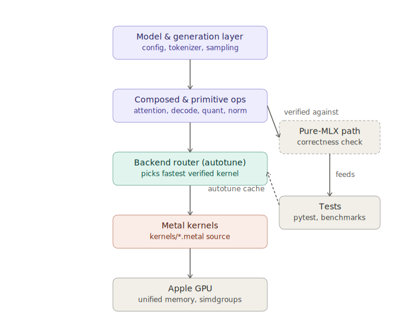

# MLX Metal Kernels

[](https://github.com/manishklach/mlx-metal-kernels/actions/workflows/ci.yml)

[](LICENSE)

Experimental MLX custom Metal kernels for Apple Silicon LLM inference.

This repository is a correctness-first kernel lab for exploring how far Apple Silicon GPUs can be pushed through MLX custom Metal kernels. It includes attention kernels, decode attention, KV-cache and paged KV-cache operations, q4/q8 quantized matvec kernels, RMSNorm, RoPE, SwiGLU, fused decode helpers, quantized decode blocks, quantized MLP blocks, experimental fused q4/q8 MLP kernels, toy transformer-layer benchmarks, autotuning infrastructure, and Llama-like model integration scaffolding.

The project is not a production inference engine. It is an experimental research repo focused on building, validating, benchmarking, and iterating on Mac-native transformer inference primitives.



Design principles:

- correctness first
- pure MLX reference path for every optimized backend
- no performance claims without local Apple Silicon benchmark data
- explicit experimental backend flags
- shape-specialized kernels where useful
- machine-specific autotuning instead of universal performance assumptions

## What this repo explores

The repo currently covers several layers of the local LLM inference stack:

- attention and FlashAttention-style streaming softmax
- decode attention over contiguous and paged KV-cache layouts
- threadgroup and simdgroup Metal experiments
- q4/q8 dequantization and quantized matvec
- multi-output tiled quantized GEMV
- experimental fused q4/q8 MLP kernels
- RMSNorm, RoPE, SwiGLU, and residual helpers
- fused and quantized decode blocks
- quantized MLP blocks
- toy transformer-layer decode benchmarks
- backend autotuning for Apple Silicon machines
- Llama-like configuration and weight-layout scaffolding
- GQA/MQA decode support
- checkpoint-to-quantized packaging scaffold
- tokenizer and sampling scaffold

## What this project is not

This repo does not currently claim to outperform MLX native kernels, CUDA FlashAttention, or production inference engines.

It is not yet a full model runtime, tokenizer pipeline, checkpoint loader, or production Llama/Mistral inference engine.

End-to-end generation from real model weights has not yet been benchmarked; current results are kernel- and block-level only.

Performance claims should only be made from benchmark data generated on a specific Apple Silicon machine.

## Kernel Families

### Attention

- Reference MLX attention
- Baseline custom Metal streaming attention
- Row-parallel attention
- Tiled K/V attention
- Threadgroup attention v2
- Shape-specialized D=64/D=128 attention
- Experimental `simdgroup_d64` attention

### Decode and KV-cache

- Contiguous KV-cache update
- Decode attention
- Paged KV-cache allocation and update
- Paged decode attention
- Decode loop helpers
- Fused decode blocks from QKV
- GQA/MQA decode-block composition
- GQA/MQA prefill attention

### Transformer primitives

- RMSNorm
- RoPE
- SwiGLU
- Residual add
- RMSNorm + residual
- QKV split
- QKV split + RoPE
- QKV + RoPE + cache update

### Quantization

- q4/q8 dequantization
- q4/q8 decode matvec
- parallel q4/q8 matvec
- multi-output tiled q4/q8 matvec
- quantized QKV projection
- quantized output projection
- quantized decode block
- quantized MLP block
- fused q4/q8 MLP experiments

### Model-level scaffolding

- Toy transformer-layer decode benchmark
- Full Llama-like decode layer experiment
- Multi-layer decode stack
- Llama-like config
- Weight-layout mapping helpers
- Model-adapter scaffold
- GQA/MQA utilities

### Benchmarking and autotuning

- Unified benchmark runner
- Local benchmark report generator
- Chip-specific backend registry
- Local autotune cache

## Project Goal

MLX makes Apple Silicon a serious local machine learning platform, but high-performance transformer inference still benefits from custom fused kernels, layout-aware memory movement, quantized matvec, and backend choices tuned to the local machine.

This project investigates how to build and validate those primitives directly in MLX using custom Metal kernels.

The core workflow is:

1. implement a pure MLX reference path
2. add a correctness-first Metal backend
3. test the Metal backend against reference
4. add experimental optimized backends
5. benchmark locally on Apple Silicon
6. use explicit backend flags or autotuning to select kernels

The project is intentionally incremental: attention, decode, KV-cache, quantized matvec, MLP, and model-level scaffolding are developed as separate testable pieces before attempting larger fused runtime paths.

## Current status

This repo is an experimental kernel research project, not a production inference runtime.

Current capabilities include:

- MLX custom Metal kernels with pure MLX reference implementations
- attention, decode attention, and paged decode attention
- KV-cache and paged KV-cache update helpers
- q4/q8 dequantization and quantized matvec kernels
- parallel and tiled q4/q8 decode matvec backends
- RMSNorm, RoPE, SwiGLU, residual, and QKV layout helpers
- fused and quantized decode-block composition
- quantized MLP-block composition
- explicit-only fused q4/q8 MLP experiments
- toy transformer-layer decode benchmark
- Llama-like config, weight layout, and model-adapter scaffolding
- GQA/MQA reference and composed decode support
- opt-in backend autotuning for local Apple Silicon machines

Stable defaults remain conservative. Experimental backends such as threadgroup, tiled, specialized, and simdgroup kernels are explicit-only unless enabled through documented flags or autotuning.

## Results

No verified benchmark numbers are published from this checkout yet.

The local evidence file [`docs/performance_report_local.md`](docs/performance_report_local.md) records the exact commands attempted during the 2026-06-20 audit and why that run stopped before correctness or benchmark data could be produced. This workspace was audited on Windows 11, and `pip install mlx --break-system-packages` failed with `No matching distribution found for mlx`, so `pytest tests -q`, `python examples/run_basic.py`, the full benchmark suite, and autotune did not complete.

Until an Apple Silicon machine completes the commands below and produces raw JSON/CSV artifacts, this README intentionally does not publish a headline results table.

```bash
python benchmarks/run_all_benchmarks.py --full --output benchmarks/results/local_results.json --csv benchmarks/results/local_results.csv
python scripts/save_benchmark_report.py benchmarks/results/local_results.json --output docs/performance_report_local.md
python benchmarks/autotune.py --op all --quick --dtype float16 --write-cache
```

## Install

```bash
pip install mlx pytest
pip install -e .
pytest tests -q
```

Run a basic example:

```bash
python examples/run_basic.py
```

Run the quick benchmark suite:

```bash
python benchmarks/run_all_benchmarks.py --quick
```

Run autotuning:

```bash
python benchmarks/autotune.py --op all --quick --dtype float16 --write-cache
python benchmarks/run_all_benchmarks.py --quick --use-autotune
```

## Quick start

```python
import mlx.core as mx
from ops.attention_ops import fast_attention

Q = mx.random.normal((1, 128, 8, 64)).astype(mx.float16)
K = mx.random.normal((1, 128, 8, 64)).astype(mx.float16)
V = mx.random.normal((1, 128, 8, 64)).astype(mx.float16)

O = fast_attention(Q, K, V, causal=True, backend="auto")
```

```python
import mlx.core as mx
from ops.decode_ops import decode_attention

q = mx.random.normal((1, 1, 8, 64)).astype(mx.float16)
K_cache = mx.random.normal((1, 128, 8, 64)).astype(mx.float16)
V_cache = mx.random.normal((1, 128, 8, 64)).astype(mx.float16)

y = decode_attention(q, K_cache, V_cache, lengths=128, backend="metal")
```

```python
import mlx.core as mx
from ops.quant_ops import pack_q4, q4_matvec_decode

x = mx.random.normal((1, 64)).astype(mx.float16)
q4_vals = (mx.random.uniform((32, 64)) * 16).astype(mx.uint8)
packed_w = pack_q4(q4_vals)
scales = mx.ones((32, 2), dtype=mx.float32)

y = q4_matvec_decode(x, packed_w, scales, group_size=32, backend="metal_tiled")
```

## Benchmark examples

### Attention

```bash
python benchmarks/bench_attention.py --backend all --S 128 --H 8 --D 64 --dtype float16
python benchmarks/bench_threadgroup_attention.py --mode prefill --B 1 --S 128 --H 8 --D 64 --dtype float16 --backend all
python benchmarks/bench_simdgroup_attention.py --mode prefill --B 1 --S 128 --H 8 --D 64 --dtype float16 --backend all
```

### Decode and KV-cache

```bash
python benchmarks/bench_decode_attention.py --B 2 --MAX_S 32 --H 8 --D 64 --length 32 --dtype float16 --backend all
python benchmarks/bench_paged_decode_attention.py --B 2 --MAX_S 128 --PAGE_SIZE 16 --H 8 --D 64 --length 128 --dtype float16 --backend all
python benchmarks/bench_decode_block.py --B 2 --MAX_S 128 --T 32 --H 8 --D 64 --dtype float16 --backend all
python benchmarks/bench_gqa_decode_attention.py --B 1 --MAX_S 128 --Hq 32 --Hkv 8 --D 128 --dtype float16 --cache contiguous --backend all
python benchmarks/bench_gqa_decode_block.py --B 1 --MAX_S 128 --Hq 32 --Hkv 8 --D 128 --T 16 --dtype float16 --cache contiguous
python benchmarks/bench_gqa_attention.py --B 1 --S 128 --Hq 32 --Hkv 8 --D 128 --dtype float16 --causal --backend all --validate
```

### Quantization

```bash
python benchmarks/bench_dequant.py --bits 4 --M 4096 --K 4096 --dtype float16 --backend all
python benchmarks/bench_quant_matvec_parallel.py --bits 4 --B 1 --K 4096 --N 4096 --group-size 32 --dtype float16 --backend all
python benchmarks/bench_quant_matvec_tiled.py --bits 4 --B 1 --K 4096 --N 4096 --dtype float16 --backend all
```

### Transformer blocks

```bash
python benchmarks/bench_quantized_decode_block.py --bits 4 --cache contiguous --B 1 --K 4096 --H 32 --D 128 --MAX_S 128 --T 16 --dtype float16 --backend-preset parallel
python benchmarks/bench_quantized_mlp_block.py --bits 4 --B 1 --S 1 --hidden-size 4096 --intermediate-size 11008 --dtype float16 --backend-preset all
python benchmarks/bench_fused_mlp_kernels.py --bits 4 --B 1 --S 1 --hidden-size 4096 --intermediate-size 11008 --dtype float16 --backend-preset all --validate
python benchmarks/bench_toy_transformer_decode.py --cache contiguous --bits 4 --B 1 --K 512 --H 8 --D 64 --INTERMEDIATE 1024 --MAX_S 64 --T 8 --dtype float16 --backend-preset parallel
python benchmarks/bench_llama_layer_decode.py --bits 4 --B 1 --T 16 --hidden-size 512 --intermediate-size 2048 --num-heads 8 --num-kv-heads 2 --head-dim 64 --MAX_S 128 --dtype float16 --backend-preset all --validate
```

The fused MLP path is experimental and explicit-only. It does not replace the stable composition-first `quantized_mlp_block` path or default backend routing.

GQA prefill avoids expanding KV heads to query heads in the optimized path.

The full Llama-like decode layer experiment is a synthetic single-layer benchmark, not a full production model runtime.

### Full benchmark suite

```bash
python benchmarks/run_all_benchmarks.py --quick
python benchmarks/run_all_benchmarks.py --quick --use-autotune
python benchmarks/run_all_benchmarks.py --full --output benchmarks/results/local_results.json --csv benchmarks/results/local_results.csv
python scripts/save_benchmark_report.py benchmarks/results/local_results.json --output docs/performance_report_local.md
```

## Benchmark Suite

The repo includes a unified benchmark runner, machine metadata capture, CSV/JSON output, and a report-generation path for local Apple Silicon measurements.

Useful entry points:

```bash
python benchmarks/run_all_benchmarks.py --quick
python benchmarks/run_all_benchmarks.py --quick --use-autotune
python benchmarks/run_all_benchmarks.py --full --output benchmarks/results/local_results.json --csv benchmarks/results/local_results.csv
python benchmarks/autotune.py --op all --quick --dtype float16 --write-cache
```

## Autotuning

Autotuning is opt-in. The repo includes a backend registry and a local JSON cache for machine-specific backend choices.

Example:

```python
from ops.autotune_ops import select_backend

backend = select_backend(
    "decode_attention",
    {"B": 1, "MAX_S": 128, "H": 8, "D": 64, "length": 128},
    "float16",
    default_backend="metal",
)
```

Commands:

```bash
python benchmarks/autotune.py --op all --quick --dtype float16 --write-cache
python benchmarks/run_all_benchmarks.py --quick --use-autotune
```

Autotune results are local to a specific machine and should not be treated as universal performance claims.

## Llama-like integration scaffold

The repo includes lightweight model-integration scaffolding for Llama-like transformer layouts.

Current scope:

- Llama-like config objects
- weight-shape mapping helpers
- fused QKV layout conventions
- model-adapter scaffold
- toy and random decode examples
- dependency-light checkpoint layout inspection and mapping helpers

Out of scope for now:

- production checkpoint loading
- tokenizer integration
- sampling loop
- full model serving runtime

Example commands:

```bash
python examples/inspect_model_shapes.py
python examples/llama_like_decode_demo.py
```

## Checkpoint layout scaffold

The repo includes a dependency-light checkpoint layout scaffold for inspecting and validating Llama-like tensor names and shapes.

Current scope:

- JSON checkpoint manifests
- Llama-style tensor name mapping
- layer-shape validation against `LlamaLikeConfig`
- fused QKV shape derivation
- q4/q8 packaging shape specs

Out of scope:

- production safetensors loading
- Hugging Face download support
- tokenizer integration
- full model execution from checkpoint

Commands:

```bash
python examples/checkpoint_manifest_demo.py
python examples/fuse_qkv_demo.py
```

This scaffold is intended to prepare the repo for future checkpoint adapter work without adding heavy dependencies.

## Real checkpoint adapter scaffold

The repo includes a dependency-light checkpoint adapter scaffold that connects local tensor stores or JSON manifests to the Llama-like config and kernel-facing weight layouts.

Current scope:

- in-memory tensor stores for tests and demos
- manifest-backed shape-only tensor stores
- optional safetensors store if `safetensors` is installed
- Llama-style layer tensor validation
- GQA-aware QKV shape handling
- fused QKV creation from q/k/v tensors
- quantized packaging specs for q4/q8 layouts

Out of scope:

- model downloads
- tokenizer
- sampling loop
- production Llama or Mistral runtime
- full checkpoint quantization or calibration

Commands:

```bash
python examples/checkpoint_adapter_demo.py
python examples/layer_weight_adapter_demo.py
```

```bash
python examples/llama_layer_decode_demo.py
```

## Checkpoint-to-quantized packaging

The repo includes a correctness-first scaffold for packaging local floating-point layer tensors into the q4/q8 layouts expected by the custom matvec kernels.

Current scope:

- groupwise q4/q8 quantization for local tensors
- q4 packing compatible with repo kernels
- scale tensor generation
- symmetric zero-point materialization for kernel compatibility
- fused QKV quantization
- layer-level `QuantizedLlamaLayerPackage`
- conversion to `LlamaLayerKernelWeights`

Out of scope:

- GPTQ, AWQ, or SmoothQuant
- production calibration
- model-quality preserving quantization
- full checkpoint conversion CLI
- tokenizer and sampling runtime

Commands:

```bash
python examples/quantize_layer_demo.py
python examples/checkpoint_to_quantized_demo.py
```

## Multi-layer decode stack

The repo includes a correctness-first multi-layer decode stack scaffold for synthetic Llama-like experiments.

Current scope:

- explicit multi-layer composition over existing single-layer decode blocks
- one KV-cache per layer
- final RMSNorm plus optional `lm_head`
- synthetic stack decode loop
- synthetic multi-layer generation demo
- GQA and MHA test coverage

Out of scope:

- production checkpoint execution
- meaningful text generation from trained weights
- optimized prefill stack
- full production multi-layer runtime

Commands:

```bash
python examples/llama_stack_decode_demo.py
python examples/toy_multilayer_generation_demo.py
python benchmarks/bench_llama_stack_decode.py --bits 4 --B 1 --T 16 --num-layers 2 --hidden-size 512 --intermediate-size 2048 --num-heads 8 --num-kv-heads 2 --head-dim 64 --MAX_S 128 --dtype float16 --backend-preset all --validate
```

This is synthetic random-weight infrastructure for runtime plumbing and cache validation, not production text generation.

## Full tiny-model generation demo

The repo includes a synthetic end-to-end generation demo that connects tokenizer, embeddings, multi-layer Llama-like decode stack, `lm_head` logits, sampling, and decoding.

Current scope:

- synthetic random weights
- `CharTokenizer` by default
- optional tokenizer adapters if installed
- q4/q8 synthetic layers
- greedy, top-k, and top-p sampling
- benchmarkable generation loop

Out of scope:

- meaningful text generation
- trained model checkpoint execution
- production chat runtime
- model downloads
- tokenizer or chat-template correctness claims

Commands:

```bash
python examples/full_tiny_generation_demo.py --prompt "Hello" --max-new-tokens 8 --greedy
python examples/full_tiny_generation_with_package_demo.py
python benchmarks/bench_tiny_generation_pipeline.py --prompt-len 8 --max-new-tokens 16 --num-layers 2 --hidden-size 512 --intermediate-size 2048 --num-heads 8 --num-kv-heads 2 --head-dim 64 --bits 4 --backend-preset fused_experimental --greedy
```

The package-based demo is intentionally conservative today. The current quantized package format carries metadata and tensor-layout information, but not the tensor payloads needed for real loading, so the helper raises a clear fallback message and switches to synthetic weights.

## Optimized prefill stack

The repo includes a multi-layer prefill path that processes prompt tokens in sequence form, fills one KV-cache per layer, and then continues generation with decode.

Current scope:

- synthetic/random weights
- contiguous KV-cache
- GQA/MQA prefill attention
- prefill-then-decode demo
- benchmark against token-by-token decode ingestion

Out of scope:

- production prompt runtime
- real trained checkpoint execution
- paged prefill unless explicitly implemented
- chat templates
- model downloads

Commands:

```bash
python examples/prefill_then_decode_demo.py
python benchmarks/bench_llama_prefill_stack.py --bits 4 --B 1 --S 64 --num-layers 2 --hidden-size 512 --intermediate-size 2048 --num-heads 8 --num-kv-heads 2 --head-dim 64 --MAX_S 128 --dtype float16 --backend-preset all --validate
```

## Checkpoint converter scaffold

The repo includes a dependency-light checkpoint converter scaffold for turning local layer tensors into repo-native q4/q8 package metadata.

Current scope:

- JSON package metadata (QuantizedCheckpointPackage)
- synthetic/in-memory conversion path
- manifest dry-run planning
- fused QKV packaging
- q4/q8 layer package metadata
- package inspection CLI
- per-layer tensor metadata (original shapes, packed shapes, scales)

Out of scope:

- model downloads
- tokenizer
- production safetensors conversion
- calibrated quantization
- GPTQ/AWQ/SmoothQuant
- full model serving

Commands:

```bash
python scripts/convert_checkpoint.py --synthetic-demo --bits 4 --group-size 32 --output /tmp/mlx_quant_package.json
python scripts/inspect_quantized_package.py /tmp/mlx_quant_package.json
python examples/checkpoint_converter_demo.py
```

## Real tokenizer adapter scaffold

The repo includes optional tokenizer adapters for local tokenizer files.

Current scope:

- toy CharTokenizer and WhitespaceTokenizer
- optional `tokenizers` JSON adapter (HFTokenizerAdapter)
- optional SentencePiece `.model` adapter (SentencePieceTokenizerAdapter)
- TokenizerAdapterFactory for auto-detection by file extension
- describe_tokenizer helper for metadata
- load_tokenizer_for_generation for generation scaffold integration
- no network access
- no model/tokenizer downloads
- unified encode/decode interface for generation scaffolds

Out of scope:

- production chat formatting
- Hugging Face hub downloads
- transformers tokenizer auto-loading
- prompt templates
- model-specific tokenizer correctness guarantees

Commands:

```bash
python examples/tokenizer_adapter_demo.py
python examples/tokenizer_adapter_demo.py --tokenizer /path/to/tokenizer.json --kind hf-tokenizers
python examples/tokenizer_adapter_demo.py --tokenizer /path/to/tokenizer.model --kind sentencepiece
```

Note: Optional tokenizer packages are not required for the repo. Install them separately only if you want local real-tokenizer experiments.

## Tokenizer and sampling scaffold

The repo includes a lightweight tokenizer, sampling, and generation scaffold for synthetic single-layer experiments.

Current scope:

- toy character tokenizer
- toy whitespace tokenizer
- greedy, top-k, and top-p sampling utilities
- repetition-penalty helper
- synthetic single-layer generation loop
- integration with the Llama-like layer decode scaffold when available
- synthetic random weights only

Out of scope:

- production tokenizer support
- BPE or SentencePiece
- Hugging Face tokenizer loading
- real text-quality generation
- full multi-layer runtime
- model downloads

Commands:

```bash
python examples/sampling_demo.py
python examples/toy_generation_demo.py
```

The toy generation demo uses random synthetic weights and is intended to test plumbing, not language quality.

## API examples

### Attention API

```python
import mlx.core as mx
from ops.attention_ops import fast_attention

Q = mx.random.normal((1, 128, 8, 64)).astype(mx.float16)
K = mx.random.normal((1, 128, 8, 64)).astype(mx.float16)
V = mx.random.normal((1, 128, 8, 64)).astype(mx.float16)

O = fast_attention(Q, K, V, causal=True, backend="auto")
O_exp = fast_attention(Q, K, V, causal=True, backend="row_parallel")
```

### Decode API

```python
import mlx.core as mx
from ops.decode_block_ops import decode_block_from_qkv
from ops.gqa_ops import gqa_decode_block_from_qkv

cos = mx.random.normal((132, 32)).astype(mx.float32)
sin = mx.random.normal((132, 32)).astype(mx.float32)
packed_qkv = mx.random.normal((1, 1, 3 * 8 * 64)).astype(mx.float16)
K_cache = mx.zeros((1, 128, 8, 64), dtype=mx.float16)
V_cache = mx.zeros((1, 128, 8, 64), dtype=mx.float16)

out, K_cache, V_cache = decode_block_from_qkv(packed_qkv, K_cache, V_cache, cos, sin, 0, H=8, D=64, backend="auto")

gqa_qkv = mx.random.normal((1, 1, 32 * 128 + 2 * 8 * 128)).astype(mx.float16)
gqa_K = mx.zeros((1, 128, 8, 128), dtype=mx.float16)
gqa_V = mx.zeros((1, 128, 8, 128), dtype=mx.float16)
gqa_out, gqa_K, gqa_V = gqa_decode_block_from_qkv(
    gqa_qkv, gqa_K, gqa_V, cos, sin, 0, num_attention_heads=32, num_key_value_heads=8, head_dim=128, backend="reference"
)
```

### Quantized matvec API

```python
import mlx.core as mx
from ops.quant_ops import pack_q4, q4_matvec_decode

x = mx.random.normal((1, 64)).astype(mx.float16)
q4_vals = (mx.random.uniform((32, 64)) * 16).astype(mx.uint8)
packed_w = pack_q4(q4_vals)
scales = mx.ones((32, 2), dtype=mx.float32)

y = q4_matvec_decode(x, packed_w, scales, group_size=32, backend="metal_tiled")
```

### Toy transformer API

```python
import mlx.core as mx
from ops.toy_transformer_ops import make_toy_layer_weights, toy_transformer_decode_layer

weights = make_toy_layer_weights(512, 1024, bits=4, group_size=32)
x = mx.random.normal((1, 1, 512)).astype(mx.float16)
K_cache = mx.zeros((1, 64, 8, 64), dtype=mx.float16)
V_cache = mx.zeros((1, 64, 8, 64), dtype=mx.float16)
cos = mx.random.normal((68, 32)).astype(mx.float32)
sin = mx.random.normal((68, 32)).astype(mx.float32)

y, K_cache, V_cache = toy_transformer_decode_layer(
    x,
    weights["attn_norm_weight"].astype(mx.float16),
    weights["ffn_norm_weight"].astype(mx.float16),
    weights["qkv_w"],
    weights["qkv_scales"],
    weights["out_w"],
    weights["out_scales"],
    weights["gate_w"],
    weights["gate_scales"],
    weights["up_w"],
    weights["up_scales"],
    weights["down_w"],
    weights["down_scales"],
    K_cache,
    V_cache,
    cos,
    sin,
    0,
    bits=4,
    H=8,
    D=64,
)
```

### Autotuning API

```python
from ops.autotune_ops import select_backend

backend = select_backend(
    "q4_matvec_decode",
    {"B": 1, "K": 4096, "N": 4096, "group_size": 32},
    "float16",
    default_backend="metal_parallel",
)
```

## Verification philosophy

Every optimized backend should have a pure MLX reference path.

The intended workflow is:

1. generate random test inputs
2. run reference implementation
3. run Metal or custom backend
4. compare outputs within dtype-appropriate tolerance
5. only then benchmark

Experimental backends may be disabled by default until they are repeatedly validated on Apple Silicon.

## Roadmap

- [x] Baseline MLX custom Metal attention
- [x] Reference correctness path
- [x] Row-parallel and tiled-K/V attention experiments
- [x] RMSNorm, RoPE, SwiGLU, residual helpers
- [x] KV-cache update and decode attention
- [x] Paged KV-cache and paged decode attention
- [x] Fused decode block helpers
- [x] q4/q8 dequantization and decode matvec
- [x] Parallel and tiled q4/q8 matvec
- [x] Quantized decode block
- [x] Threadgroup attention v2
- [x] Simdgroup attention experiments
- [x] Unified benchmark and report suite
- [x] Chip-specific autotuning
- [x] Toy transformer-layer decode benchmark
- [x] Llama-like model integration scaffold
- [x] Quantized MLP block
- [x] GQA/MQA support
- [x] Checkpoint layout loader scaffold
- [x] Full tiny-model generation demo
- [x] Optimized prefill stack
- [ ] Optimized GQA Metal decode attention
- [ ] Fused q4 MLP kernel
- [x] Real checkpoint adapter scaffold
